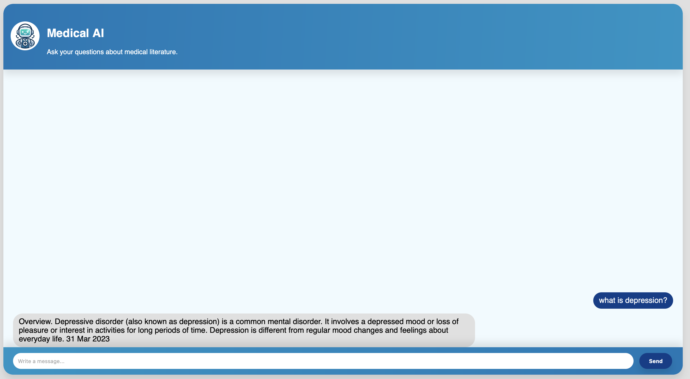

In the contemporary healthcare environment, several persistent challenges affect both patients and healthcare professionals. Patients often struggle to determine which specialist to consult based on their symptoms, leading to delays in appropriate care and potentially resulting in ineffective or incorrect treatment. Healthcare professionals face the daunting task of staying updated with the extensive and continually expanding body of medical literature, making it difficult to keep abreast of the latest developments and increasing the complexity involved in prescribing the correct medication.
To address these issues, a comprehensive AI-based system was developed in a user-friendly website format. This system offers tailored access and functionalities based on the user type, including separate logins for doctors, patients, and administrators. Three models—Literature Review Model, Drug Recommendation Model, and Disease Detection Model—were meticulously trained to facilitate key aspects of healthcare, leveraging advanced artificial intelligence and machine learning techniques to enhance healthcare delivery and support medical practice.

The Literature Review Model assists healthcare professionals in efficiently accessing and reviewing relevant medical literature, utilizing a specialized dataset compiled from textbooks and medical literature, and supported by web scraping for continuous updates. The Drug Recommendation Model aids doctors in selecting appropriate medications by providing evidence-based recommendations tailored to individual patient needs, reducing uncertainty and enhancing the quality of patient care. The Disease Detection Model, leveraging the BERT architecture, accurately identifies diseases based on symptoms, aiding both patients and doctors in diagnostic support. The dataset for this model includes extensive combinations of symptoms and their corresponding diseases. The system's integration into a chatbot format further enhances its accessibility and usability for end-users. The project's expected impact includes improved healthcare accessibility and effectiveness, reduced medication errors, and enhanced decision-making for both patients and healthcare professionals. Future directions may involve expanding the models' capabilities and integrating additional functionalities to further support comprehensive healthcare solutions.

You can access the video link, the source code, the poster, and the report of this prohect from above and here:
- [Video Link](https://github.com/academicpages/academicpages.github.io)
- [Project Report](https://evrencagilci.github.io/medical.github.io//files/Final_bitirme.pdf)
- [Source Code]()
- [Poster](https://evrencagilci.github.io/medical.github.io//files/final_poster.pdf)
